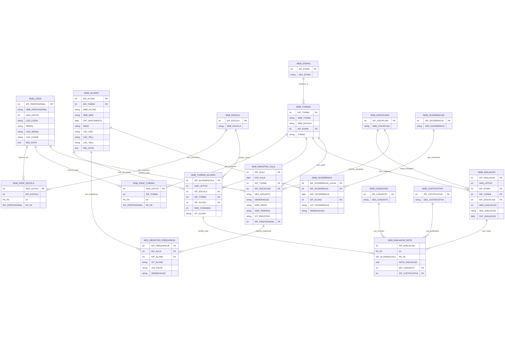

# Relatório de Análise Técnica do Código-Fonte – Aplicativo Sábio

## Sumário

*   [1. Introdução](#1-introdução)
*   [2. Arquitetura e Tecnologias](#2-arquitetura-e-tecnologias)
    *   [2.1. Arquitetura em Camadas (Visão Não-Técnica)](#21-arquitetura-em-camadas-visão-não-técnica)
    *   [2.2. Arquitetura Técnica e Tecnologias](#22-arquitetura-técnica-e-tecnologias)
    *   [2.3. Módulos Principais da Aplicação](#23-módulos-principais-da-aplicação)
*   [3. Análise Detalhada por Módulo](#3-análise-detalhada-por-módulo)
    *   [3.1. Módulo de Login (`@src/app/login`)](#31-módulo-de-login-srcapplogin)
    *   [3.2. Módulo Meus Dados (`@src/app/meus-dados`)](#32-módulo-meus-dados-srcappmeus-dados)
    *   [3.3. Módulo Acadêmico (`@src/app/academico`)](#33-módulo-acadêmico-srcappacademico)
    *   [3.4. Módulo Ajustes (`@src/app/ajustes`)](#34-módulo-ajustes-srcappajustes)
    *   [3.5. Módulo Notificações (`@src/app/notificacoes`)](#35-módulo-notificações-srcappnotificacoes)
    *   [3.6. Módulo Sincronização (`@src/app/sincronizacao`)](#36-módulo-sincronização-srcappsincronizacao)
    *   [3.8. Módulo Intro (`@src/app/intro`)](#38-módulo-intro-srcappintro)
*   [4. Comunicação Externa e APIs](#4-comunicação-externa-e-apis)
*   [5. Requisitos de Permissões](#5-requisitos-de-permissões)
*   [6. Módulo Core - Cub3 (`@src/app/cub3`)](#6-módulo-core---cub3-srcappcub3)
*   [7. Banco de Dados](#7-banco-de-dados)

---

## 1. Introdução

Este documento apresenta uma análise técnica objetiva do código-fonte do aplicativo "Sábio" (`educanetNovo`). O objetivo é avaliar a estrutura da aplicação, suas funcionalidades, tecnologias e fluxos de interação, identificando pontos de atenção, riscos potenciais e oportunidades de melhoria na base de código existente. As referências aos arquivos-fonte são fornecidas para rastreabilidade.

Este é um documento evolutivo e será atualizado à medida que a análise dos módulos progride.

## 2. Arquitetura e Tecnologias

Esta seção descreve a arquitetura geral do aplicativo Sábio, desde uma perspectiva conceitual até os detalhes técnicos das tecnologias utilizadas.

### 2.1. Arquitetura em Camadas (Visão Não-Técnica)

Podemos imaginar a arquitetura do aplicativo como um restaurante bem estruturado:

*   **O Salão de Atendimento (Frontend - `src/app`):** Esta é a parte do aplicativo que o usuário vê e com a qual interage — as telas, os botões e os menus. Cada módulo principal (`login`, `academico`, `meus-dados`) funciona como uma área diferente do salão: a recepção onde você se identifica, a área principal onde as atividades acontecem, e uma sala de funcionários para dados pessoais.

*   **A Cozinha Central (Backend Services - Módulo `cub3`):** Nos bastidores, há uma grande cozinha que prepara tudo. Quando um usuário clica em um botão no "Salão", um pedido é enviado para a "Cozinha". Esta cozinha é responsável por buscar dados, aplicar regras de negócio e entregar o resultado pronto para ser exibido. Atualmente, a cozinha do Sábio é um único e grande chef (`Cub3SvcProvider`) que faz de tudo, desde preparar os pratos até lavar a louça, o que pode gerar sobrecarga.

*   **A Despensa e Geladeira (Banco de Dados Local - SQLite):** Para funcionar mesmo sem entregas (internet), o restaurante mantém uma despensa bem abastecida. O aplicativo faz o mesmo, guardando todos os dados essenciais (alunos, turmas, notas) em um banco de dados local no celular. Isso permite que o "chef" continue trabalhando e servindo os clientes mesmo que a conexão com o mundo exterior caia.

*   **Os Garçons (Capacitor):** São eles que fazem a ponte entre o restaurante e o mundo real. Quando o aplicativo precisa usar a câmera do celular para ler um QR Code ou o GPS para registrar a localização do professor, é o "garçom" (Capacitor) que busca essa informação no dispositivo e a entrega para a "Cozinha" ou para o "Salão".

### 2.2. Arquitetura Técnica e Tecnologias

O aplicativo é uma aplicação móvel híbrida, construída sobre um stack de tecnologias web modernas e empacotada para rodar nativamente em dispositivos móveis.

*   **Framework Base:** O núcleo da aplicação é construído com **`@angular/core`** (~9.1.6) e **`@ionic/angular`** (^5.0.0). 
    *   **Angular** fornece a estrutura de componentes, injeção de dependência e o ferramental para construir uma Single-Page Application (SPA).
    *   **Ionic** atua sobre o Angular, oferecendo uma rica biblioteca de componentes de UI (botões, listas, abas, etc.) otimizados para a aparência e o comportamento de aplicativos móveis.

*   **Ponte Nativa (Native Bridge):** A comunicação entre o código web (Angular/Ionic) e as funcionalidades nativas do dispositivo (câmera, GPS, sistema de arquivos) é gerenciada pelo **`@capacitor/core`** (3.2.2). Ele substitui o antigo Cordova e permite que o aplicativo acesse recursos do hardware de forma moderna e performática.

*   **Persistência de Dados (Armazenamento Local):**
    *   **Banco de Dados Relacional:** A principal forma de armazenamento é um banco de dados **SQLite**, gerenciado pelo plugin **`@capacitor-community/sqlite`** (^3.7.0). Ele é responsável por armazenar todos os dados de negócio para permitir o funcionamento offline (detalhado na Seção 7).
    *   **Armazenamento Chave-Valor:** O aplicativo também faz uso de `localStorage` (abstraído por `StorageUtils`) para salvar dados de sessão e configurações mais simples.

*   **Principais Dependências e Funcionalidades:**
    *   **Comunicação de Rede:** A comunicação com as APIs do servidor é feita através do **`@capacitor-community/http`** (^1.2.0). Há também uma dependência de `cordova-plugin-ftp` (^1.1.1), indicando uma possível funcionalidade de transferência de arquivos via FTP.
    *   **Recursos do Dispositivo:**
        *   `@capacitor-mlkit/barcode-scanning` (^5.4.0): Para a leitura de QR Codes (usado no login).
        *   `@capacitor/camera` (^1.0.5): Para capturar fotos.
        *   `cordova-plugin-geolocation` (^4.0.2): Para obter a localização do usuário (usado no registro de jornada).
    *   **Componentes de UI e Auxiliares:**
        *   `@tinymce/tinymce-angular` (^4.2.4): Um editor de texto rico (Rich Text Editor), provavelmente usado em campos de observação ou descrição.
        *   `ng2-pdf-viewer` (^6.3.0): Para visualizar documentos PDF dentro do aplicativo.
        *   `openvidu-browser` (^2.18.1) e `twilio-video` (^2.16.0): Indicam a existência de uma funcionalidade de videoconferência ou comunicação por vídeo em tempo real.

### 2.3. Módulos Principais da Aplicação

O aplicativo é organizado em um conjunto de módulos funcionais dentro do diretório `src/app`. A análise inicial da estrutura de pastas e do arquivo de roteamento principal (`app-routing.module.ts`) revela os seguintes módulos:

*   **`intro`**: Módulo para a tela de introdução/onboarding do aplicativo.
*   **`login`**: Gerencia todo o processo de autenticação do usuário.
*   **`academico`**: Módulo central que encapsula a maior parte das funcionalidades de negócio (gestão de turmas, notas, frequência, etc.).
*   **`meus-dados`**: Seção de gerenciamento de informações pessoais do usuário logado.
*   **`ajustes`**: Módulo para as configurações do aplicativo.
*   **`notificacoes`**: Central de notificações.
*   **`sincronizacao`**: Módulo técnico para sincronização de dados entre o dispositivo e o servidor.
*   **`cub3`**: Módulo de serviço, identificado pelo `Cub3AuthGuard` como responsável pelo controle de acesso às rotas autenticadas.

## 3. Análise Detalhada por Módulo

### 3.1. Módulo de Login (`@src/app/login`)

**Visão Geral (Explicação Não-Técnica)**

Pense no módulo de login como a portaria principal de um grande colégio. É o primeiro ponto de contato e o mais importante para a segurança. A responsabilidade deste porteiro é garantir que apenas pessoas autorizadas — professores, no caso — possam entrar.

O porteiro do aplicativo Sábio é bastante versátil. Ele consegue:
1.  **Reconhecer rostos familiares:** Se um professor já entrou recentemente, o porteiro pode simplesmente acenar e deixá-lo passar, sem pedir as credenciais de novo (verificação de sessão).
2.  **Pedir as credenciais completas:** Para um primeiro acesso ou se a identificação antiga expirou, ele pede o conjunto completo de informações (escola, matrícula, CPF, etc.).
3.  **Ler crachás com QR Code:** Para agilizar, o professor pode simplesmente apresentar um crachá com um QR Code, e o porteiro faz a leitura para liberar o acesso rapidamente.
4.  **Lidar com imprevistos:** Se o leitor de QR Code falhar, o porteiro é inteligente o suficiente para permitir que o professor mostre uma foto do crachá que ele tenha guardado no celular.

O problema é que este "porteiro" (o componente de login) também acumula outras funções, como verificar se as luzes do pátio estão acesas (permissões do celular) e se o livro de registros principal está pronto (iniciar o banco de dados), o que o deixa sobrecarregado.

---

**Análise Técnica Detalhada**

Este módulo é o ponto de entrada para autenticação. A implementação centraliza múltiplos fluxos de acesso e lógicas de negócio em um único componente.

#### 3.1.1. Análise da Implementação da Interface (`login.page.html`, `login.page.scss`)

*   **Estrutura Dupla (Desktop/Mobile):** O código utiliza duas estruturas de HTML distintas, controladas por CSS Media Queries, para renderizar a tela em dispositivos móveis e desktops. A versão mobile adota um fluxo de duas etapas (seleção de perfil e depois formulário), enquanto a versão desktop apresenta o formulário diretamente. Esta abordagem duplica blocos de HTML, o que pode aumentar a complexidade da manutenção.
*   **Estilização Dinâmica:** O CSS utiliza classes (`.verde`, `.azul`, etc.) para alterar o tema de cores da interface com base no tipo de perfil de usuário selecionado.
*   **Múltiplos Formulários:** Existem dois elementos `<form>` no HTML, um para cada visão (desktop e mobile). Ambos estão vinculados às mesmas funções no componente, exigindo um gerenciamento cuidadoso para evitar comportamentos inesperados.

#### 3.1.2. Análise da Lógica de Negócio (`login.page.ts`)

O arquivo `login.page.ts` é um componente extenso (aprox. 750 linhas) que acumula um número significativo de responsabilidades.

*   **Fluxo de Autenticação:**
    1.  **Verificação de Sessão Existente (`verificarUsuario`):** O componente verifica o armazenamento local. Se um usuário existe e há conexão, valida a sessão no backend (`verificarSessao`). Em caso de falha de rede, permite o acesso offline.
    2.  **Múltiplos Métodos de Login:**
        *   **Manual:** Coleta dados de 5 campos e os submete para autenticação online ou offline.
        *   **QR Code (`loginQrCode`):** Utiliza `@capacitor-mlkit/barcode-scanning`. Implementa um mecanismo de fallback (`tratarErroScanQrCode`) que usa `@capacitor/camera` para permitir a seleção de uma imagem da galeria, processando-a com a biblioteca `jsQR`.

*   **Acoplamento de Responsabilidades:** O componente gerencia diretamente o estado da UI, animações (`AnimationController`), solicitações de permissões nativas (`requestAndroidPermissions`) e a inicialização do banco de dados (`iniciarDb`), acoplando a lógica de autenticação à infraestrutura da aplicação.

#### 3.1.3. Pontos de Atenção e Recomendações (Módulo Login)

1.  **Violação do Princípio de Responsabilidade Única (SRP):** O componente `LoginPage` concentra responsabilidades demais (autenticação, UI, permissões, DB).
    *   **Recomendação:** Refatorar a lógica para serviços dedicados (`AuthenticationService`, `PermissionService`, `QRCodeService`, `DatabaseService`) para melhorar a manutenibilidade, o desacoplamento e a testabilidade do código.

2.  **Risco de Segurança no Armazenamento Local:** A função `realizarLogin` salva o objeto `this.login` (que inclui a senha em texto plano) no armazenamento local se a opção "Salvar dados" for marcada.
    *   **Análise de Risco:** Se `StorageUtils` for um wrapper para `localStorage` sem criptografia, as credenciais do usuário ficam expostas a riscos caso o dispositivo seja comprometido. **Este é um ponto de atenção de segurança crítico.**
    *   **Recomendação:** Auditar a implementação de `StorageUtils`. Se não houver criptografia, é **mandatório** migrar para uma solução de armazenamento seguro (como Capacitor Secure Storage) ou implementar uma camada de criptografia para todos os dados sensíveis salvos no dispositivo.

3.  **Tratamento de Erros Genérico:** Os blocos `catch` e as validações de login frequentemente disparam alertas com mensagens genéricas ("Ocorreu um problema").
    *   **Impacto:** A falta de feedback específico dificulta o diagnóstico de problemas para o usuário final e para a equipe de suporte.
    *   **Recomendação:** Refinar o tratamento de erros para fornecer mensagens mais contextuais e registrar logs de erro detalhados para facilitar a depuração.

4.  **Padronização de Alertas:** Observa-se o uso de um serviço (`cub3Svc.alerta` e `alertCtrl`) para exibir mensagens.
    *   **Recomendação:** Criar uma documentação ou guia de estilo para esses alertas, definindo padrões para títulos, mensagens e tipos (erro, sucesso, aviso). Isso garantirá consistência na comunicação com o usuário em todo o sistema.

### 3.2. Módulo Meus Dados (`@src/app/meus-dados`)

**Visão Geral (Explicação Não-Técnica)**

Se o aplicativo é um colégio, o módulo "Meus Dados" é a sala dos professores. É uma área pessoal e administrativa onde o usuário gerencia suas próprias informações e atividades, que são distintas do trabalho pedagógico direto com os alunos.

Dentro desta "sala", o professor encontra:
*   **Seu Quadro de Atribuições:** Uma lista de todas as escolas onde ele trabalha (`meus-dados-escolas`) e as matérias que leciona (`meus-dados-disciplinas`).
*   **Sua Folha de Ponto:** Um histórico completo de seus registros de entrada e saída (`meus-dados-frequencia`).
*   **O Relógio de Ponto:** Uma função para registrar um novo ponto (`meus-dados-registro-jornada-novo`). De forma inteligente, o aplicativo usa o GPS do celular para verificar se o professor está realmente na escola no momento do registro, agindo como um crachá de ponto com geolocalização.

O principal ponto de atenção aqui é que cada uma dessas funções busca as informações diretamente do "arquivo local" (o banco de dados do celular), em vez de passar por um "secretário" (um serviço centralizado). Além disso, a forma como ele pede permissão para usar o GPS é um pouco brusca: em vez de pedir educadamente, ele pode recarregar a tela inteira se a permissão não for concedida, o que não é uma boa experiência.

---

**Análise Técnica Detalhada**

Este módulo funciona como uma área pessoal para o usuário, centralizando informações e funcionalidades relacionadas ao seu perfil. Ele adapta seu conteúdo com base no tipo de usuário (Professor ou Aluno).

#### 3.2.1. Visão Geral e Estrutura

O ponto de entrada do módulo é a `MeusDadosPaginaPage`, que atua como um menu de navegação.

*   **Navegação por Perfil:** A página utiliza `*ngSwitchCase` para renderizar listas de opções diferentes para os perfis `PROFESSOR` e `ALUNO`. Isso direciona os usuários para funcionalidades específicas de seu contexto, como "Escolas de atuação" para professores ou "Boletim" para alunos.
*   **Funcionalidade de Logout:** A página principal também contém a função `logout()`, que remove os dados da conta do `StorageUtils` e redireciona o usuário para a tela de login.

O módulo é composto pelos seguintes submódulos principais:

*   **`meus-dados-pagina`**: A página de menu principal.
*   **`meus-dados-escolas`**: Exibe a lista de escolas associadas ao professor.
*   **`meus-dados-disciplinas`**: Exibe a lista de disciplinas lecionadas pelo professor.
*   **`meus-dados-frequencia`**: Apresenta o histórico de registros de jornada (entrada/saída) do professor.
*   **`meus-dados-registro-jornada-novo`**: Implementa o formulário para um novo registro de ponto, utilizando geolocalização.
*   **`meus-dados-registro-jornada`**: Um componente que parece ser um placeholder, sem implementação visível.

#### 3.2.2. Análise da Lógica de Negócio

*   **Acesso Direto a Dados Locais:** Vários componentes acessam dados diretamente do armazenamento local, seja via `StorageUtils` ou consultas diretas ao SQLite com `Cub3DbProvider`.
    *   `MeusDadosEscolasPage`: Carrega as informações das escolas diretamente de `StorageUtils.getItem("data")`.
    *   `MeusDadosDisciplinasPage`: Executa la query `SELECT * FROM MOB_DISCIPLINAS` para obter os dados.
    *   `MeusDadosFrequenciaPage`: Executa `SELECT * FROM MOB_PROF_FRQ` para buscar o histórico.
*   **Registro de Jornada com Geolocalização (`meus-dados-registro-jornada-novo.page.ts`):**
    *   **Permissões:** O componente solicita ativamente permissões de localização do Android (`ACCESS_FINE_LOCATION`). Caso a permissão não seja concedida, a página é recarregada (`window.location.reload()`), o que representa uma experiência de usuário inadequada.
    *   **Captura de Coordenadas:** Utiliza o `geolocation.watchPosition()` para monitorar a localização do usuário e `geolocation.getCurrentPosition()` no momento do registro.
    *   **Persistência Local:** Ao confirmar o registro, os dados (incluindo tipo de registro, data, hora e coordenadas) são inseridos diretamente na tabela `MOB_PROF_FRQ` do banco de dados SQLite.
    *   **Dependência de Dados:** A funcionalidade depende da existência de dados da escola (`MOB_ESCOLA`) no banco de dados local para associar o registro de ponto.

#### 3.2.3. Pontos de Atenção e Recomendações (Módulo Meus Dados)

1.  **Alto Acoplamento com a Camada de Dados:** Os componentes estão diretamente acoplados às implementações de armazenamento (`StorageUtils`) e banco de dados (`Cub3DbProvider`). Isso torna os componentes frágeis, difíceis de testar e reutilizar.
    *   **Recomendação:** Abstrair todo o acesso a dados para serviços dedicados (ex: `ProfessorDataService`, `AttendanceService`). Os componentes devem injetar esses serviços e solicitar os dados, sem conhecer os detalhes de implementação (SQLite, `localStorage`, etc.).

2.  **Lógica de Negócio na Camada de Visualização:** A lógica para solicitar permissões, obter geolocalização e salvar dados no banco está toda contida nos arquivos `.page.ts`.
    *   **Recomendação:** Mover essa lógica para os serviços recomendados no ponto anterior. O componente deve apenas coletar a entrada do usuário e invocar os métodos do serviço.

3.  **Gerenciamento de Permissões Ineficiente:** O fluxo de solicitação de permissão em `meus-dados-registro-jornada-novo` é problemático. Forçar o recarregamento da página é disruptivo.
    *   **Recomendação:** Implementar um `PermissionService` (conforme sugerido para o módulo de Login) para gerenciar o ciclo de vida das permissões de forma centralizada e fornecer feedback claro e não disruptivo ao usuário.

4.  **Dependências de Dados Implícitas:** As páginas assumem que os dados necessários (como escolas) já foram sincronizados e estão disponíveis localmente. A falha em encontrar esses dados leva a alertas genéricos.
    *   **Recomendação:** Implementar um gerenciamento de estado mais robusto ou, no mínimo, verificações explícitas no início do ciclo de vida dos componentes. Se os dados essenciais estiverem ausentes, a UI deve apresentar um estado de erro claro, instruindo o usuário a realizar a sincronização.

5.  **Código Inacabado/Placeholder:** O submódulo `meus-dados-registro-jornada` parece ser um scaffold não utilizado.
    *   **Recomendação:** Remover código não utilizado para simplificar a base de código e evitar confusão para futuros desenvolvedores.

### 3.3. Módulo Acadêmico (`@src/app/academico`)

**Visão Geral (Explicação Não-Técnica)**

Este é o coração da escola, o pátio central e as salas de aula do aplicativo. É o módulo mais importante e complexo para o professor, onde todo o trabalho pedagógico acontece. Ele foi projetado como um "diário de classe digital" completo.

A organização é similar a uma pasta de professor, com várias abas:
*   **Aba "Início" (Painel Rápido):** Funciona como um quadro de avisos na sala dos professores, oferecendo uma visão geral e rápida das últimas aulas registradas, atalhos para as turmas e um resumo das atividades recentes.
*   **Aba "Pedagógico" (Caixa de Ferramentas):** É o menu principal de ações, a "caixa de ferramentas" do professor. Daqui, ele pode acessar a lista de alunos, planejar o conteúdo das próximas aulas, registrar uma ocorrência disciplinar, etc.
*   **Aba "Turmas" (Salas de Aula):** Uma lista direta de todas as turmas do professor. Clicar em uma delas é como entrar na sala de aula virtual daquela turma.
*   **Aba "Meu Perfil" (Área Administrativa):** Uma pequena área de configurações onde o professor pode forçar a sincronização de dados com o sistema central da escola ou limpar os dados locais do aplicativo.

As principais atividades que o professor realiza aqui são:
*   **Registrar Aulas e Frequência:** O aplicativo guia o professor passo a passo para registrar uma nova aula (escolhendo a turma, a matéria, o conteúdo). Em seguida, ele pode fazer a chamada, seja vendo a lista de todos os alunos de uma vez ou passando por eles um a um, como se fosse de carteira em carteira.
*   **Lançar Notas:** Esta é a caderneta digital. O professor vê a lista de alunos e as avaliações criadas, podendo inserir as notas diretamente.

O grande desafio deste módulo é sua imensa complexidade. É como se um único professor estivesse tentando dar aula, fazer a chamada, corrigir provas e correr para o arquivo para pegar e guardar cada documento, tudo ao mesmo tempo. A lógica de negócio e o acesso aos dados estão misturados, tornando o módulo difícil de manter e escalar.

---

**Análise Técnica Detalhada**

Este é o módulo mais extenso e central da aplicação para o perfil de professor, abrangendo a maior parte das funcionalidades pedagógicas, como gestão de turmas, aulas, notas, frequência, conteúdo programático e ocorrências.

#### 3.3.1. Visão Geral e Estrutura

A navegação principal do módulo é organizada em torno do componente `academico-abas`, que utiliza uma interface de `ion-tabs` com quatro seções principais:

*   **Aba 1 (Início):** Um dashboard que apresenta resumos de informações relevantes, como últimas atividades, alunos e turmas, utilizando componentes `ion-slides` para uma navegação horizontal.
*   **Aba 2 (Pedagógico):** Um menu estático que serve como um ponto de acesso para as diversas funcionalidades do módulo, como "Alunos por Turma", "Conteúdo Programático" e "Registro de Ocorrências".
*   **Aba 3 (Turmas):** Exibe uma lista das turmas associadas ao professor, permitindo a navegação para a tela de detalhes de cada turma.
*   **Aba 4 (Meu Perfil):** Uma área de perfil e configurações, com funcionalidades para sincronizar dados, limpar dados locais e finalizar a sessão.

O módulo é composto por uma vasta coleção de páginas e submódulos, cada um focado em uma funcionalidade específica, o que indica uma alta complexidade e um grande escopo de features.

#### 3.3.2. Análise da Lógica de Negócio e Componentes

*   **Dashboard (`academico-aba1.page.ts`):** A página de início busca dados de múltiplas fontes para popular os carrosséis, utilizando chamadas diretas a `cub3Svc.getTurmas()`, `cub3Svc.listarAlunos()` e `cub3Svc.getNode("atividades/listar")`. A composição dos dados é feita diretamente no componente de UI.

*   **Gerenciamento de Aulas e Frequência (`academico-aula-novo`, `academico-aula-editar`, `academico-frequencia`):**
    *   A criação e edição de aulas seguem um fluxo de "wizard" implementado com `ion-slides`, onde cada slide representa uma etapa (seleção de disciplina, período, conteúdo, etc.).
    *   A página de frequência (`academico-frequencia.page.ts`) permite ao professor registrar a presença dos alunos de duas formas: em uma lista completa (`modoExibicao = 'Lista'`) ou um aluno por vez (`modoExibicao = 'Slides'`).
    *   A lógica para determinar o status de frequência de um aluno é notavelmente complexa, envolvendo a verificação de múltiplos registros em diferentes tabelas locais (`MOV_REGISTRO_FREQUENCIA`, `MOB_REGISTRO_AULA`) para consolidar o status (presente/ausente).

*   **Gerenciamento de Notas (`academico-turma-nota-alunos.page.ts`):**
    *   Este componente permite o lançamento de notas para uma turma inteira. A interface é uma lista de alunos onde o professor pode inserir as notas para múltiplas avaliações.
    *   A lógica de cálculo de média (`calcularMediaNotas`) e a persistência dos dados (`atualizarNotaAluno`) são realizadas diretamente no componente, que manipula o `cub3Db` (SQLite) através do `setStorage`.

*   **Sincronização e Dados Offline (`academico-aba3` e `academico-aba4`):**
    *   A presença de botões como "Sincronizar sessão" e "Limpar aulas" em `academico-aba4.page.ts` confirma a arquitetura híbrida (online/offline) da aplicação.
    *   A função `sincronizar()` busca os dados mais recentes do backend (`educanet/profissional/mobile`) e os salva localmente usando `StorageUtils.setItem("escolas", ...) `.
    *   A função `limparDados()` remove registros das tabelas locais (`MOB_REGISTRO_AULA`, `MOV_REGISTRO_FREQUENCIA`), reforçando o controle manual do cache de dados pelo usuário.

#### 3.3.3. Pontos de Atenção e Recomendações (Módulo Acadêmico)

1.  **Extremo Acoplamento e Baixa Coesão:** Este é o débito técnico mais significativo. Os componentes do módulo `academico` possuem uma responsabilidade excessiva, gerenciando estado da UI, fazendo chamadas diretas a serviços de baixo nível (`cub3Db`, `cub3Svc`), manipulando dados de múltiplas fontes (API, `StorageUtils`, SQLite) e contendo lógica de negócio complexa.
    *   **Recomendação:** É crucial refatorar para extrair a lógica de negócio e o acesso a dados para serviços dedicados. A adoção do padrão **Facade** por feature (ex: `TurmaFacade`, `AvaliacaoFacade`) centralizaria a orquestração de dados, simplificando os componentes e melhorando a testabilidade.

2.  **Gerenciamento de Estado Manual e Reativo:** O estado da UI é controlado por múltiplas flags (`carregando`, `horariosCarregados`, etc.) e atualizações manuais com `ChangeDetectorRef.markForCheck()`. Este padrão é propenso a erros, difícil de manter e escalar.
    *   **Recomendação:** Adotar uma biblioteca de gerenciamento de estado (como **NgRx** ou **NGXS**). Isso criaria uma fonte única da verdade para o estado da aplicação, simplificaria o fluxo de dados e tornaria os componentes mais declarativos.

3.  **Dependência Direta do `StorageUtils` e `cub3Db`:** O acesso direto ao `localStorage` (via `StorageUtils`) e ao SQLite (via `cub3Db`) nos componentes cria uma forte dependência da estrutura de dados armazenada. Qualquer alteração no formato dos dados pode quebrar diversas partes do sistema.
    *   **Recomendação:** Abstrair completamente o acesso ao armazenamento. Os componentes devem interagir com serviços que fornecem os dados, sem saber se a origem é uma API, o cache local ou o banco de dados.

4.  **Lógica de Negócio Complexa e Duplicada:** Funções para obter e processar dados, como `getAlunos` em `academico-frequencia.page.ts`, contêm uma lógica aninhada e complexa para consolidar informações de diferentes fontes. É provável que lógicas similares estejam espalhadas por outros componentes.
    *   **Recomendação:** Centralizar regras de negócio em serviços específicos. Por exemplo, um `FrequenciaService` deveria encapsular a complexidade de determinar o status de um aluno, expondo um método simples como `getStatus(alunoId, aulaId)`.

### 3.4. Módulo Ajustes (`@src/app/ajustes`)

**Visão Geral (Explicação Não-Técnica)**

Pense neste módulo como a "sala de manutenção" do aplicativo. É uma área simples e funcional, focada em tarefas de "limpeza" e gerenciamento geral, em vez de funcionalidades pedagógicas.

Nesta sala, o usuário tem acesso a duas ferramentas principais:
*   **"Apagar arquivos":** Funciona como um botão para esvaziar o depósito. O aplicativo pode baixar materiais de apoio, como vídeos e documentos. Esta opção permite ao usuário apagar esses arquivos baixados para liberar espaço de armazenamento no celular.
*   **"Finalizar sessão":** Este é o botão de "desligar geral". Ele encerra a sessão do usuário de forma segura, limpando suas informações de login do dispositivo e o levando de volta para a tela de entrada (login).

Um ponto a ser observado é que a ferramenta de "Apagar arquivos" poderia ser mais comunicativa. Atualmente, ela informa que o trabalho foi concluído após alguns segundos, mesmo que tenha encontrado algum problema no meio do caminho e não tenha conseguido apagar tudo.

---

**Análise Técnica Detalhada**

Este módulo oferece uma tela de configurações simples, com funcionalidades de gerenciamento de dados locais e de sessão.

#### 3.4.1. Visão Geral e Estrutura

A `AjustesPage` fornece uma interface com duas ações principais para o usuário:

*   **Apagar arquivos:** Permite ao usuário limpar o cache de mídias (vídeos, materiais) baixados pelo aplicativo.
*   **Finalizar sessão:** Realiza o logout do usuário, limpando os dados de sessão e redirecionando para a tela de login.

Adicionalmente, o rodapé da página exibe a versão atual do aplicativo, obtida a partir do arquivo de configuração `cub3-config`.

#### 3.4.2. Análise da Lógica de Negócio (`ajustes.page.ts`)

*   **Logout (`logout()`):** A função invoca `StorageUtils.logout()`, que limpa todos os dados do `localStorage`, efetivamente deslogando o usuário. A navegação para a tela de login é feita após um `setTimeout` de 300ms.

*   **Limpeza de Arquivos (`apagarArquivos()`):** Esta funcionalidade utiliza o plugin `@ionic-native/file` para interagir com o sistema de arquivos do dispositivo. Ela itera sobre uma lista predefinida de diretórios (`['videos', 'materiais']`) dentro da pasta de dados do aplicativo e remove cada arquivo encontrado.

#### 3.4.3. Pontos de Atenção e Recomendações (Módulo Ajustes)

1.  **Tratamento de Erros na Exclusão de Arquivos:** A função `apagarArquivos` possui blocos `catch` que apenas registram erros no console (`console.log`). O usuário não é notificado se a exclusão de um ou mais arquivos falhar. Pior ainda, uma mensagem de sucesso é exibida após um `setTimeout` de 3 segundos, independentemente do resultado das operações.
    *   **Recomendação:** Implementar um tratamento de erros robusto. É recomendável utilizar `Promise.allSettled` para aguardar o resultado de todas as operações de exclusão de arquivo. Com base nos resultados, o usuário deve ser informado com uma mensagem específica, seja de sucesso completo, sucesso parcial ou falha total.

2.  **Acoplamento Direto com Plugin Nativo:** O componente importa e utiliza o `@ionic-native/file` diretamente, acoplando a lógica da página à implementação de um plugin nativo.
    *   **Recomendação:** Abstrair as operações do sistema de arquivos para um serviço dedicado (ex: `FileSystemService`). O componente `AjustesPage` injetaria este serviço, tornando-o mais simples, mais fácil de testar (com mocks) e promovendo a reutilização dessa lógica em outras partes do sistema, se necessário.

3.  **Uso de `setTimeout` para Navegação Pós-Logout:** A função `logout` utiliza um `setTimeout` para atrasar a navegação para a tela de login. Embora `localStorage.clear()` seja uma operação síncrona, este padrão pode ser frágil em cenários assíncronos mais complexos.
    *   **Recomendação:** Embora não seja um problema crítico aqui, a melhor prática é garantir que todas as operações de limpeza sejam concluídas antes de redirecionar o usuário. Se o logout envolvesse qualquer operação assíncrona, ela deveria ser aguardada (`await`) antes da chamada de `router.navigate`.

### 3.5. Módulo Notificações (`@src/app/notificacoes`)

**Visão Geral (Explicação Não-Técnica)**

Este módulo deveria ser o "mural de avisos" ou a "caixa de correio" do professor. No entanto, na prática, é um mural vazio com um aviso permanente que diz "Nenhuma notificação". A estrutura foi criada, mas a funcionalidade para buscar e mostrar mensagens reais nunca foi implementada.

---

**Análise Técnica Detalhada**

Este módulo foi projetado para ser a central de notificações do aplicativo, mas sua implementação atual é um placeholder.

#### 3.5.1. Visão Geral e Estrutura

O módulo consiste em um único componente, `NotificacoesPage`, que é acessado através da rota `/notificacoes`. A estrutura do módulo é mínima, contendo apenas os arquivos básicos gerados pelo CLI do Ionic/Angular.

#### 3.5.2. Análise da Lógica de Negócio (`notificacoes.page.ts` e `notificacoes.page.html`)

*   **Componente (`notificacoes.page.ts`):** A classe do componente é praticamente vazia. Ela injeta o `Cub3SvcProvider`, mas o utiliza apenas para exibir o nome do aplicativo no cabeçalho da página. O método `ngOnInit` está vazio e não há nenhuma lógica para buscar, processar ou exibir notificações.

*   **Template (`notificacoes.page.html`):** A interface do usuário é estática. Ela exibe um cabeçalho e uma lista com um único item contendo a mensagem fixa: "Nenhuma notificação disponível no momento". Não há qualquer vinculação de dados (data binding) para exibir notificações de forma dinâmica.

#### 3.5.3. Pontos de Atenção e Recomendações (Módulo Notificações)

1.  **Funcionalidade Inexistente:** O módulo, em seu estado atual, não possui nenhuma funcionalidade real. Ele serve apenas como um componente de UI estático e não cumpre o propósito de uma central de notificações.

2.  **UI Estática e Enganosa:** A mensagem "Nenhuma notificação disponível no momento" é permanentemente exibida, independentemente de haver ou não notificações para o usuário. Isso pode levar à confusão, pois o usuário nunca verá nenhuma notificação real.

3.  **Recomendação — Implementação Completa:** O módulo precisa ser completamente desenvolvido. A implementação deve incluir:
    *   **Serviço de Notificações:** Criar um `NotificationService` responsável por buscar as notificações de uma fonte de dados (API backend ou armazenamento local).
    *   **Lógica no Componente:** O `NotificacoesPage` deve injetar o `NotificationService` e usar seus métodos para carregar a lista de notificações.
    *   **UI Dinâmica:** O template HTML deve ser modificado para iterar sobre a lista de notificações e exibi-las dinamicamente. Deve também tratar o caso de a lista estar vazia, mostrando a mensagem apropriada apenas quando for o caso.
    *   **Gerenciamento de Estado:** Implementar a lógica para marcar notificações como lidas/não lidas e permitir que o usuário interaja com elas (ex: navegar para uma tela específica ao tocar em uma notificação).

### 3.6. Módulo Sincronização (`@src/app/sincronizacao`)

**Visão Geral (Explicação Não-Técnica)**

Este módulo é como uma sala que consta na planta do colégio, mas que nunca foi construída. É um espaço vazio, um placeholder. A intenção era, provavelmente, centralizar aqui toda a lógica de sincronização de dados (o processo de enviar e receber informações do servidor central da escola). No entanto, essa "sala de sincronização" nunca foi equipada, e a tarefa acabou sendo feita de forma improvisada em outros locais do aplicativo.

---

**Análise Técnica Detalhada**

Este módulo representa um scaffold gerado que nunca foi implementado.

#### 3.6.1. Visão Geral e Estrutura

O módulo `sincronizacao` contém apenas os arquivos básicos de um componente de página do Ionic (`.ts`, `.html`, `.scss`, `.module.ts`, `.routing.ts`). Não há código ou lógica implementada.

#### 3.6.2. Análise da Implementação

*   **Componente (`sincronizacao.page.ts`):** A classe do componente está vazia, sem nenhuma propriedade ou método.
*   **Template (`sincronizacao.page.html`):** O HTML contém apenas um cabeçalho padrão com o título "sincronizacao" e uma área de conteúdo vazia.
*   **Estilo (`sincronizacao.page.scss`):** O arquivo de estilo está vazio.

#### 3.6.3. Pontos de Atenção e Recomendações (Módulo Sincronizacao)

1.  **Código Morto/Não Utilizado:** O módulo é um componente completamente vazio e não é utilizado em nenhuma parte da aplicação. A lógica de sincronização existente está distribuída em outros módulos, como o `academico`.

2.  **Recomendação — Remoção e Centralização:**
    *   **Remover o Módulo:** Este módulo deve ser removido da base de código para eliminar código morto e reduzir a complexidade do projeto.
    *   **Centralizar a Lógica:** A funcionalidade de sincronização, atualmente espalhada por outros componentes, deve ser refatorada e centralizada em um serviço dedicado (ex: `SyncService`). Isso promoveria a reutilização de código, melhoraria a manutenibilidade e desacoplaria a lógica de sincronização dos componentes de UI.

Módulo Intro (`@src/app/intro`)

Este módulo corresponde à tela inicial de boas-vindas (splash screen) da aplicação.

#### 3.7.1. Visão Geral e Estrutura

O módulo é composto por um único componente, `IntroPage`, que serve como o primeiro ponto de contato visual do usuário com o aplicativo. Sua responsabilidade é apresentar a marca, uma mensagem de boas-vindas e direcionar o usuário para a tela de login.

#### 3.7.2. Análise da Implementação

*   **Interface (`intro.page.html`, `intro.page.scss`):** A interface é visualmente elaborada, utilizando uma imagem de fundo, um logo principal e um conjunto de ícones decorativos que flutuam na parte superior da tela. Na parte inferior, uma seção de conteúdo apresenta o logo do cliente, um texto de boas-vindas e um botão "Iniciar sessão".

*   **Lógica de Negócio (`intro.page.ts`):** A lógica do componente é focada em duas tarefas principais:
    1.  **Navegação:** A função `entrar()` é acionada pelo botão principal e tem a única responsabilidade de navegar o usuário para a rota `/login`.
    2.  **Solicitação de Permissões:** No evento de ciclo de vida `ionViewDidEnter`, o componente verifica se a plataforma é Android e, em caso afirmativo, solicita imediatamente uma lista extensa de permissões, incluindo `CAMERA`, `RECORD_AUDIO`, `ACCESS_FINE_LOCATION`, entre outras. O menu lateral também é desabilitado nesta tela.

#### 3.7.3. Pontos de Atenção e Recomendações (Módulo Intro)

1.  **Má Prática na Solicitação de Permissões:** A principal bandeira vermelha neste módulo é a solicitação de múltiplas permissões de forma "upfront" (antecipada), assim que o aplicativo é aberto. Esta abordagem é prejudicial à experiência do usuário por duas razões:
    *   **Falta de Contexto:** O usuário é bombardeado com pedidos de permissão sem entender por que o aplicativo precisa de acesso à sua câmera, microfone e localização antes mesmo de qualquer interação.
    *   **Alta Taxa de Rejeição:** A falta de contexto aumenta a probabilidade de o usuário negar as permissões, o que pode quebrar funcionalidades essenciais mais tarde e exigir um tratamento de erro mais complexo para solicitar a permissão novamente.

2.  **Recomendação — Solicitação de Permissões "Just-in-Time":** A melhor prática é solicitar permissões apenas no momento em que elas são estritamente necessárias para uma funcionalidade. Por exemplo:
    *   A permissão de **Câmera** deve ser solicitada quando o usuário tentar escanear um QR Code no `LoginPage`.
    *   A permissão de **Localização** deve ser solicitada quando o professor acessar a tela de "Registro de Jornada" no módulo `Meus Dados`.
    *   A lógica de solicitação de permissões deve ser removida do `IntroPage` e movida para os componentes específicos que dependem desses recursos nativos.

## 4. Comunicação Externa e APIs

Esta seção detalha a arquitetura de comunicação do aplicativo com serviços externos, incluindo as APIs, os endpoints e os métodos de requisição utilizados. A comunicação é um pilar para as funcionalidades de login, sincronização de dados e operações em tempo real.

### 4.1. Visão Geral e Autenticação

A comunicação externa é quase inteiramente centralizada no `Cub3SvcProvider`. A aplicação se comunica com duas APIs principais, indicando uma possível arquitetura de microsserviços ou uma transição de um sistema legado para um mais moderno.

*   **API Principal (Legada):** `https://api.portaleducanet.com.br/`
*   **API Node.js:** `https://node.educanethomeclass.com.br:49996/`

O `Cub3SvcProvider` utiliza dois clientes HTTP diferentes, dependendo do contexto de execução:
*   **`@angular/common/http` (`httpo`):** Usado principalmente para chamadas à API Node.js e em contextos de navegador.
*   **`@ionic-native/http/ngx` (`http`):** Usado para garantir a comunicação em ambientes nativos (iOS/Android), lidando com restrições de CORS de forma mais eficaz.

#### 4.1.1. Fluxo de Autenticação

A autenticação é híbrida, utilizando tanto um token JWT quanto o envio direto de credenciais, dependendo do endpoint.

1.  **Obtenção do Token:** O processo de login na API Node.js (`/login/mobile`) retorna um token de autenticação, que é armazenado localmente via `StorageUtils.getToken()`.
2.  **Autenticação via Token:** Para a maioria das requisições à API Node.js, o token é enviado no cabeçalho `Authorization`.
    *   **Exemplo:** `Authorization: <token>`
3.  **Autenticação via Credenciais:** Diversas requisições para a API Legada, principalmente as de sincronização, não utilizam o token. Em vez disso, enviam um payload contendo `usuario`, `senha` e `chave_acesso` em cada chamada. Este é um padrão de segurança mais fraco.

### 4.2. Detalhamento dos Endpoints HTTP

Abaixo está uma análise detalhada dos principais endpoints, incluindo método, descrição, arquivo fonte e detalhes da requisição.

---

#### 4.2.1. API Node.js (`https://node.educanethomeclass.com.br:49996/`)

| Endpoint | Método | Descrição | Arquivo Fonte | Detalhes da Requisição (Payload/Params) |
| :--- | :--- | :--- | :--- | :--- |
| `/login/mobile` | `POST` | Autentica o usuário (professor) e retorna um token JWT. | `cub3/cub3-svc/cub3-svc.ts` | **Header:** `Content-Type: application/json`.<br>**Payload:** `{ "usuario": "...", "senha": "...", "chave": "...", "ano": "...", "app": "educanet" }` |
| `/loginInstrutor` | `POST` | Variação do login para o tipo "instrutor". | `cub3/cub3-svc/cub3-svc.ts` | **Header:** `Content-Type: application/json`.<br>**Payload:** Objeto com dados do instrutor. |
| `/loginAluno` | `POST` | Variação do login para o tipo "aluno". | `cub3/cub3-svc/cub3-svc.ts` | **Header:** `Content-Type: application/json`.<br>**Payload:** Objeto com dados do aluno. |
| `/verificarSessao` | `GET` | Verifica se o token de sessão atual é válido. | `cub3/cub3-svc/auth.service.ts` | **Header:** `Authorization: <token>`.<br>**Params:** Nenhum. |
| `/validarFacial/v2` | `POST` | Submete uma imagem para validação biométrica facial do usuário. | `cub3/cub3-svc/cub3-svc.ts` | **Header:** `Content-Type: application/x-www-form-urlencoded`.<br>**Payload:** `idUsuario`, `candidate` (imagem em base64). |
| `/educanet/aulas/mobile/` | `PUT` | Envia um lote de aulas e frequências registradas offline. | `cub3/cub3-svc/cub3-svc.ts` | **Header:** `Content-Type: application/x-www-form-urlencoded`, `Authorization: <token>`.<br>**Payload:** `usuario`, `senha`, `chave_acesso`, `mob_registro_aula: JSON.stringify({ MOB_REGISTRO_AULA: [...] })`. |
| `/quiz/{...}` | `GET`/`POST` | Realiza operações de CRUD para a funcionalidade de Quizzes (`listar`, `novo`, `atualizar`, `deletar`, `visualizar`). | `academico/academico-quizz/...` | **Header:** `Authorization: <token>`.<br>**Payload (POST):** Objeto com dados do quiz ou `{id: ...}` para deleção. <br>**Params (GET):** `?id=...` para visualizar. |
| `/atividades/{...}` | `GET`/`POST` | Realiza operações de CRUD para a funcionalidade de Atividades (`listar`, `novo`, `atualizar`, `deletar`, `visualizar`). | `academico/academico-atividades/...` | **Header:** `Authorization: <token>`.<br>**Payload (POST):** Objeto com dados da atividade ou `{id: ...}` para deleção. <br>**Params (GET):** `?id=...` para visualizar. |
| `/atividades/chat/novo` | `POST` | Envia uma nova mensagem no chat de uma atividade. | `academico/academico-atividade-visualizar/...` | **Header:** `Authorization: <token>`.<br>**Payload:** `{ id_atividade: ..., id_usuario: ..., mensagem: "..." }` |
| `/aulas/chat/novo` | `POST` | Envia uma nova mensagem no chat de uma aula/transmissão. | `cub3/cub3-video-participantes/...` | **Header:** `Authorization: <token>`.<br>**Payload:** `{ id_aula: ..., id_usuario: ..., mensagem: "..." }` |
| `/arquivo` | `GET` | Atua como um proxy para servir/baixar arquivos. | `academico/academico-aba1/academico-aba1.page.ts` | **Header:** `Authorization: <token>`.<br>**Params:** `?url=...` (URL do arquivo a ser baixado). |
| `/suporte/uploadArquivo` | `POST` | Realiza o upload de um arquivo genérico. | `academico/academico-atividade-novo/...` | **Header:** `Authorization: <token>`.<br>**Payload:** `FormData` com o arquivo. |

---

#### 4.2.2. API Principal/Legada (`https://api.portaleducanet.com.br/`)

| Endpoint | Método | Descrição | Arquivo Fonte | Detalhes da Requisição (Payload/Params) |
| :--- | :--- | :--- | :--- | :--- |
| `/login/chaves-acesso/` | `GET` | Obtém a lista de chaves de acesso (instituições) disponíveis. | `login/login.page.ts` | **Params:** Nenhum. |
| `/profissional/logar/` | `POST` | Sincroniza os dados gerais do profissional (turmas, alunos, etc.). | `cub3/cub3-svc/cub3-svc.ts` | **Header:** `Content-Type: application/x-www-form-urlencoded`.<br>**Payload:** `chave_acesso`, `ano_letivo`, `usuario`, `senha`. |
| `/profissional/aluno/ocorrencia/` | `POST` | Envia registros de ocorrências feitas offline. | `cub3/cub3-svc/cub3-svc.ts` | **Header:** `Content-Type: application/x-www-form-urlencoded`.<br>**Payload:** `usuario`, `senha`, `chave_acesso`, `mob_ocorrencia: JSON.stringify({ MOB_OCORRENCIA: [...] })`. |
| `/profissional/turma/aluno/avaliacao/nota/` | `POST` | Envia as notas de uma avaliação. | `cub3/cub3-svc/cub3-svc.ts` | **Header:** `Content-Type: application/x-www-form-urlencoded`.<br>**Payload:** `usuario`, `senha`, `chave_acesso`, `ano_letivo`, `avaliacao_nota: JSON.stringify({ MOB_AVALIACOES_ALUNOS: [...] })`. |
| `/profissional/frequencia/` | `POST` | Registra o ponto do professor (entrada/saída). | `cub3/cub3-svc/cub3-svc.ts` | **Header:** `Content-Type: application/x-www-form-urlencoded`.<br>**Payload:** `usuario`, `senha`, `chave_acesso`, `mob_prof_frq: JSON.stringify({ MOB_PROF_FRQ: [...] })`. |
| `/profissional/plano_aula/{...}` | `GET` | Obtém os planos de aula do professor. | `cub3/cub3-svc/cub3-svc.ts` | **Params:** A URL é montada com `chave_acesso`, `usuario`, `senha`, `ano_letivo`. |
| `/homeclass_alunos/{...}` | `GET` | Busca alunos de uma turma específica para o Homeclass. | `academico/academico-atividade-visualizar/...` | **Params:** A URL é montada com a chave da instituição, ano letivo e ID da turma. |

### 4.3. Comunicação via WebSocket (Não utilizada)

O arquivo `app.module.ts` contém a configuração para uma conexão via WebSocket utilizando a biblioteca `ngx-socket-io`.

*   **URL do Servidor:** `http://[NODE_URL]:49994`
*   **Transporte:** `websocket`

Apesar da infraestrutura estar configurada e uma classe `SocketLocal` ter sido criada para injeção de dependência, **nenhuma parte do código-fonte da aplicação efetivamente utiliza esta conexão**. Não foram encontradas chamadas aos métodos `socket.emit()`, `socket.on()` ou `socket.fromEvent()`.

**Conclusão:** A funcionalidade de WebSocket foi planejada ou iniciada, mas está atualmente inativa ou foi abandonada.

### 4.4. Comunicação via FTP (Não utilizada)

A lista de dependências do projeto inclui o plugin `cordova-plugin-ftp` e o wrapper `@ionic-native/ftp/ngx`. No entanto, uma busca completa pelo código **não revelou qualquer uso funcional** deste plugin.

**Conclusão:** O plugin de FTP é uma dependência órfã, provavelmente um resquício de uma funcionalidade antiga ou que não foi implementada.

### 4.5. Pontos de Atenção e Recomendações

1.  **Autenticação Inconsistente e Insegura:** O uso simultâneo de tokens e credenciais em texto plano no corpo da requisição é uma falha de segurança e um forte indicativo de débito técnico. A API legada, em particular, depende de um padrão de autenticação obsoleto e inseguro.
    *   **Recomendação Crítica:** Padronizar toda a autenticação para usar o token JWT no cabeçalho `Authorization` (Bearer Token). A API legada deve ser atualizada para validar este token, eliminando o envio de senhas em cada requisição.

2.  **Duplicidade de APIs:** A existência de duas APIs com responsabilidades sobrepostas (ambas lidam com dados pedagógicos) aumenta a complexidade da manutenção e do fluxo de dados.
    *   **Recomendação:** Avaliar a possibilidade de unificar a comunicação em uma única API Gateway ou migrar completamente as funcionalidades legadas para a API Node.js, a fim de simplificar a arquitetura.

3.  **Múltiplos Formatos de Requisição:** O código utiliza tanto `application/json` quanto `application/x-www-form-urlencoded`, muitas vezes enviando JSON stringificado dentro de um campo de formulário, o que é uma prática incomum e ineficiente.
    *   **Recomendação:** Padronizar o formato de comunicação, preferencialmente utilizando `Content-Type: application/json` para todas as requisições. Os payloads complexos devem ser enviados como objetos JSON nativos, não como strings dentro de outro formato.

4.  **Dependências Não Utilizadas:** A presença de código e dependências para WebSocket e FTP que não são utilizados aumenta o *bundle* final da aplicação e a complexidade do projeto sem agregar valor.
    *   **Recomendação:** Remover as dependências (`ngx-socket-io`, `@ionic-native/ftp/ngx`) e suas configurações associadas para limpar a base de código.

## 5. Requisitos de Permissões

As dependências do projeto indicam a necessidade das seguintes permissões no dispositivo do usuário para o funcionamento completo da aplicação:

*   **INTERNET:** Para sincronização e comunicação com APIs.
*   **READ/WRITE_EXTERNAL_STORAGE:** Para manipulação de arquivos.
*   **CAMERA:** Para leitura de QR Code, envio de fotos e videoconferência.
*   **ACCESS_FINE_LOCATION / ACCESS_COARSE_LOCATION:** Para funcionalidades baseadas em geolocalização.
*   **RECORD_AUDIO / MODIFY_AUDIO_SETTINGS:** Para videoconferência.
*   **USE_BIOMETRIC / USE_FINGERPRINT:** Para autenticação biométrica.

### 6. Módulo Core - Cub3 (`@src/app/cub3`)

Este é o módulo mais crítico e central de toda a arquitetura da aplicação, funcionando como um "Shared Module" ou "Core Module" monolítico.

#### 6.1. Análise Original (Visão Geral)

O `Cub3Module` não representa uma funcionalidade de negócio, mas sim uma biblioteca interna que fornece uma vasta gama de recursos para todos os outros módulos. Sua estrutura é composta por:

*   **Serviços (`cub3-svc`):** Contém o `Cub3SvcProvider`, um serviço monolítico que atua como um "canivete suíço" para a aplicação, além dos serviços de autenticação (`Cub3AuthService`, `Cub3AuthGuard`).
*   **Banco de Dados (`cub3-db`):** Abstrai o acesso ao banco de dados local (`Cub3DbProvider`), com implementações para SQLite (nativo) e WebSQL (navegador).
*   **Modelos de Dados (`classes`):** Define a estrutura de todas as entidades de negócio da aplicação (ex: `Usuario`, `Aluno`, `Turma`, `Aula`).
*   **Componentes de UI:** Fornece componentes reutilizáveis, desde um simples cabeçalho (`Cub3HeaderComponent`) até funcionalidades complexas de vídeo e câmera (`Cub3CameraComponent`, `WebcamModalComponent`, `Cub3VideoParticipantesComponent`).
*   **Utilitários (`utils`):** Inclui classes de ajuda, como `StorageUtils` para manipulação do `localStorage`.
*   **Configuração (`cub3-config.ts`):** Centraliza constantes e URLs da aplicação.

#### 6.2. Análise Aprofundada (Mapeamento de Banco, Entidades e Serviços)

*   **Mapeamento do Banco de Dados e Persistência:**
    *   **Definição do Esquema (`@src/assets/cub3/sql/init.json`):** Este arquivo contém múltiplos comandos `CREATE TABLE` em SQL, definindo a estrutura completa do banco de dados local.
    *   **Provedor de Acesso ao Banco (`@src/app/cub3/cub3-db/cub3-db.ts`):** A classe `Cub3DbProvider` atua como a camada de acesso a dados (DAO), mas com uma complexidade crítica: possui uma **estratégia de persistência dupla e confusa**. Utiliza SQLite em dispositivos móveis e WebSQL (obsoleto) em navegadores, mas, em paralelo, oferece um conjunto de métodos (`getStorage`, `setStorage`, `queryStorage`) que manipulam o `@ionic/storage` (geralmente `localStorage`). Isso cria duas fontes de verdade para os dados, um débito técnico severo.

*   **Entidades de Dados (`@src/app/cub3/classes/`):**
    *   Classes como `Aluno`, `Usuario`, `Turma` modelam as tabelas do banco e as respostas da API. São **Modelos Ricos**, contendo não apenas dados, mas também lógica de apresentação (ex: `Aluno.ts` com o método `getAvatar()`).

*   **O "God Service" - `Cub3SvcProvider.ts`:**
    *   Este serviço é o "canivete suíço" da aplicação, centralizando responsabilidades de forma excessiva: comunicação com API, controle de UI (alertas, toasts), lógica de sincronização offline, interação com hardware (câmera) e funções utilitárias.

*   **Componentes de UI e Features Complexas:**
    *   O módulo também exporta componentes reutilizáveis (`Cub3HeaderComponent`) e encapsula funcionalidades inteiras, como a suíte de vídeo em tempo real (`Cub3CameraComponent`, `WebcamModalComponent`).

*   **Autenticação e Utilitários:**
    *   Contém os serviços de autenticação (`auth.service.ts`) e utilitários de acesso direto ao `localStorage` (`storage.utils.ts`).

#### 6.3. Diagrama de Relacionamento das Entidades (Simplificado)

O diagrama abaixo ilustra as principais relações entre as tabelas do banco de dados local.

#### 6.4. Pontos de Atenção e Recomendações (Módulo Cub3)

1.  **Violação Massiva do Princípio de Responsabilidade Única (SRP):** O `Cub3Module`, e especialmente o `Cub3SvcProvider`, são "God Objects". Eles fazem de tudo, tornando o código extremamente difícil de manter e testar.
2.  **Alto Acoplamento:** Quase todos os módulos da aplicação dependem diretamente do `Cub3Module`. Qualquer alteração em uma função interna do `Cub3SvcProvider` tem o potencial de quebrar múltiplas funcionalidades.
3.  **Dificuldade de Teste:** É praticamente inviável escrever testes unitários eficazes para o `Cub3SvcProvider` devido à sua enorme quantidade de dependências e responsabilidades.
4.  **Estratégia de Persistência Confusa:** A coexistência de um provedor de banco de dados (`Cub3DbProvider`) com métodos que manipulam o `localStorage` para fins similares cria uma arquitetura de dados ambígua e propensa a erros.
5.  **Recomendação Estratégica:** Para futuras manutenções, é crucial **decompor este módulo**.
    *   **Refatorar `Cub3SvcProvider`:** Extrair suas responsabilidades para serviços menores e focados (ex: `ApiService`, `SyncService`, `UiNotificationService`, `CameraService`).
    *   **Criar um `CoreModule`:** Para abrigar os serviços singleton (instanciados uma única vez).
    *   **Criar um `SharedUiModule`:** Para declarar e exportar componentes de UI reutilizáveis.
    *   **Unificar a Persistência:** Escolher uma única estratégia de persistência (SQLite/IndexedDB) e centralizar todo o acesso através de serviços de repositório, eliminando a duplicação de lógica com o `localStorage`.

## 7. Banco de Dados

Esta seção detalha a estrutura, o propósito e os relacionamentos do banco de dados local, que é o coração do funcionamento offline do aplicativo Sábio.

### 7.1. Visão Geral e Arquitetura de Dados (Explicação Não-Técnica)

Para entender o banco de dados de forma simples, podemos imaginá-lo como um grande arquivo de aço de uma escola, perfeitamente organizado.

*   **Gaveta 1: Pessoas**
    *   **Fichas de Professores (`MOB_LOGIN`):** Contém a ficha de cada professor, com seu nome, login, senha e outras informações de acesso.
    *   **Fichas de Alunos (`MOB_ALUNOS`):** A ficha de cada aluno, com nome, data de nascimento, nome da mãe e contatos.

*   **Gaveta 2: A Estrutura da Escola**
    *   **Pastas de Escolas (`MOB_ESCOLA`):** Uma pasta para cada escola.
    *   **Pastas de Séries (`MOB_ETAPAS`):** Pastas para "Ensino Fundamental", "9º Ano", etc.
    *   **Pastas de Turmas (`MOB_TURMAS`):** Pastas para "Turma 9A", "Turma 9B", que pertencem a uma série e a uma escola.
    *   **Pastas de Matérias (`MOB_DISCIPLINAS`):** Uma pasta para "Matemática", "Português", etc.

*   **Gaveta 3: Conectando Tudo (Tabelas de Ligação)**
    Como um professor pode dar aula em várias turmas e um aluno só pertence a uma, usamos "fichas de ligação" para conectar tudo:
    *   `MOB_PROF_ESCOLA`: Liga um professor a uma escola.
    *   `MOB_PROF_TURMAS`: Liga um professor a uma turma.
    *   `MOB_TURMAS_ALUNOS`: É a **matrícula**, a ficha que coloca um aluno específico dentro de uma turma em uma escola.

*   **Gaveta 4: O Dia a Dia (Registros de Atividades)**
    Esta é a gaveta mais movimentada, onde o trabalho diário é registrado:
    *   **Diário de Classe (`MOB_REGISTRO_AULA`):** Cada vez que um professor dá uma aula, ele preenche uma folha neste diário, anotando o assunto, a data e a matéria.
    *   **Lista de Chamada (`MOV_REGISTRO_FREQUENCIA`):** Anexada a cada "Diário de Classe", esta lista marca quem estava presente ou ausente.
    *   **Caderneta de Notas (`MOB_AVALIACAO` e `MOB_AVALIACAO_NOTA`):** O professor primeiro cria uma "Avaliação" (ex: "Prova 1º Bimestre"). Depois, ele preenche a "Folha de Notas" com a nota de cada aluno para aquela avaliação.
    *   **Livro de Ocorrências (`MOB_OCORRENCIA`):** Onde são registradas as ocorrências disciplinares ou pedagógicas de cada aluno.

*   **Catálogos de Referência (Tabelas Auxiliares)**
    Para manter a padronização, o sistema usa pequenos catálogos:
    *   `MOB_OCORRENCIAS`: Lista os tipos de ocorrência (Atraso, Indisciplina).
    *   `MOB_CONCEITOS`: Lista os conceitos que podem ser usados nas notas (A, B, C ou Ótimo, Bom).
    *   `MOB_JUSTIFICATIVA`: Lista os tipos de justificativa para faltas ou notas.

Essa organização garante que, mesmo sem internet, o professor tenha em seu dispositivo todos os dados de que precisa para gerenciar suas turmas, registrar aulas, fazer a chamada e lançar notas.

### 7.2. Documentação Técnica

O banco de dados local é a espinha dorsal da funcionalidade offline do aplicativo, projetado para espelhar os dados essenciais do servidor e permitir que o professor realize todas as suas tarefas sem uma conexão ativa.

*   **Tecnologia:** A aplicação utiliza um banco de dados relacional **SQLite**, que é o padrão de fato para armazenamento de dados estruturados em aplicações móveis. A interação é gerenciada através do plugin `@capacitor-community/sqlite`.

*   **Arquivos de Referência do Esquema:** A estrutura do banco de dados está consolidada e documentada nos seguintes artefatos do projeto:
    *   `dbdiagram.io`: Arquivo no formato DBML que serve como a documentação visual e textual principal do esquema e seus relacionamentos. **É a fonte da verdade para o design do banco.**
    *   `schema.sql`: Script SQL "limpo" contendo apenas os comandos `CREATE TABLE` com todas as restrições. Ideal para referência rápida da estrutura.
    *   `populated_schema.sql`: Script SQL completo que cria o esquema e o popula com dados de exemplo, essencial para desenvolvimento e testes.

#### 7.2.1. Análise da Estrutura e Tabelas Principais

As tabelas são organizadas em quatro grupos lógicos, refletindo a arquitetura de um sistema de gestão acadêmica.

**1. Entidades Principais:** São as tabelas que armazenam os dados mestres do sistema.
    *   `MOB_LOGIN`: Armazena os dados dos profissionais (usuários).
    *   `MOB_ALUNOS`: Cadastro central de todos os alunos.
    *   `MOB_ESCOLA`, `MOB_ETAPAS`, `MOB_TURMAS`, `MOB_DISCIPLINAS`: Descrevem a estrutura física e pedagógica (escolas, séries, turmas e matérias).

**2. Tabelas de Junção (Relacionamento N-para-N):** Essenciais para conectar as entidades principais.
    *   `MOB_PROF_ESCOLA`: Associa professores a escolas.
    *   `MOB_PROF_TURMAS`: Associa professores a turmas.
    *   `MOB_PROF_DISCIPLINAS`: Associa um professor a uma disciplina dentro de uma turma específica.
    *   `MOB_TURMAS_ALUNOS`: A tabela de **matrícula**, que efetivamente conecta um aluno a uma turma em uma escola para um determinado ano letivo. É uma das tabelas mais centrais do sistema.

**3. Tabelas Transacionais:** Registram as atividades do dia a dia. São as tabelas que mais crescem em volume de dados.
    *   `MOB_REGISTRO_AULA`: Cada linha é uma aula ministrada, com o conteúdo abordado.
    *   `MOV_REGISTRO_FREQUENCIA`: Registra a presença ou ausência de cada aluno em cada aula registrada na tabela anterior.
    *   `MOB_AVALIACAO` e `MOB_AVALIACAO_NOTA`: Permitem a criação de avaliações (provas, trabalhos) e o lançamento das notas correspondentes para cada aluno matriculado.
    *   `MOB_OCORRENCIA`: Armazena registros disciplinares ou pedagógicos.

**4. Tabelas Auxiliares (Catálogos):** Tabelas de apoio que servem como "listas de opções" para outras partes do sistema, garantindo a consistência dos dados.
    *   `MOB_OCORRENCIAS`, `MOB_CONCEITOS`, `MOB_JUSTIFICATIVA`: Contêm as descrições para tipos de ocorrências, conceitos de notas e justificativas, respectivamente.

#### 7.2.2. Estratégia de Chaves e Integridade de Dados

A integridade do banco de dados é mantida por um uso consistente de chaves primárias e estrangeiras.

*   **Chaves Primárias (PK):** A maioria das tabelas usa uma única coluna `INTEGER` como chave primária (ex: `IDF_ALUNO` em `MOB_ALUNOS`). Tabelas transacionais como `MOB_REGISTRO_AULA` e `MOB_OCORRENCIA` utilizam `PRIMARY KEY AUTOINCREMENT` para gerar IDs únicos localmente no dispositivo, evitando conflitos antes da sincronização com o servidor.

*   **Chaves Primárias Compostas:** As tabelas de junção (ex: `MOB_PROF_TURMAS`) utilizam chaves primárias compostas por múltiplos campos (ex: `ANO_LETIVO`, `IDF_TURMA`, `IDF_PROFISSIONAL`). Isso garante que a combinação de um professor a uma turma em um ano letivo seja única.

*   **Chaves Estrangeiras (FK):** As restrições de chave estrangeira (`FOREIGN KEY`) são usadas extensivamente para garantir a integridade referencial. Por exemplo, não é possível registrar uma frequência (`MOV_REGISTRO_FREQUENCIA`) para um aluno que não existe na tabela `MOB_ALUNOS`. O comando `PRAGMA foreign_keys = ON;` no início do script `populated_schema.sql` é crucial para ativar essa verificação no SQLite.

#### 7.2.3. Considerações de Desempenho e Sincronização

*   **Funcionamento Offline:** O propósito deste banco de dados é permitir que o aplicativo funcione de forma autônoma. Os dados são carregados do servidor central durante o processo de **sincronização** e armazenados localmente. Novos registros (aulas, frequências, notas) são salvos primeiro no SQLite local e posteriormente enviados ao servidor quando uma conexão estiver disponível.

*   **Potencial de Indexação:** Embora os scripts de criação não definam índices explicitamente (além daqueles criados automaticamente para as chaves primárias), a performance em dispositivos com grande volume de dados se beneficiaria enormemente da criação de **índices** nas colunas de chave estrangeira (ex: `MOV_REGISTRO_FREQUENCIA.IDF_AULA`, `MOV_REGISTRO_FREQUENCIA.IDF_ALUNO`, `MOB_REGISTRO_AULA.IDF_TURMA`). Isso aceleraria drasticamente as consultas (`SELECT`) que utilizam `JOIN`s entre as tabelas.

#### 7.2.4. Diagrama de Entidade-Relacionamento (ER)
O diagrama abaixo ilustra a estrutura completa do banco de dados, incluindo todas as tabelas e seus relacionamentos.




```
